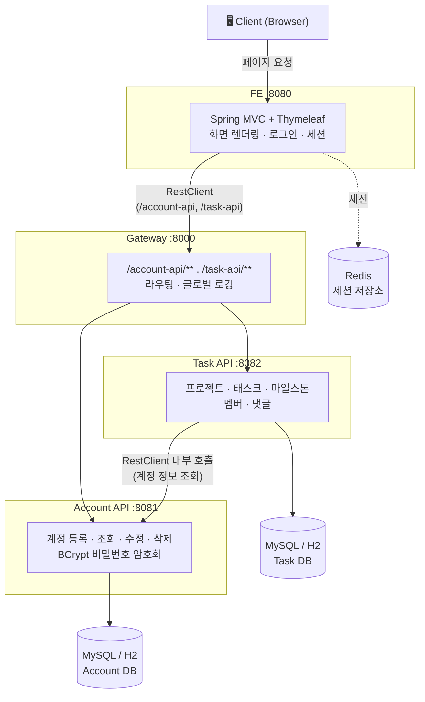

# 📋 miniDooray

**NHN 두레이(Dooray)를 벤치마킹한 협업 툴 클론 프로젝트**

MSA 기반으로 설계한 프로젝트·태스크·마일스톤·멤버 관리 협업 서비스

*NHN Academy AIOT 3기 · Team 11 · 2026.05.14 ~ 2026.05.22*

---

## 👥 Team 11

<table>
<tr>
<td align="center" width="150">
<a href="https://github.com/hetgwi01"> <b>김동건</b></a> 
Account API · Task API (마일스톤 · 멤버)
</td>
<td align="center" width="150">
<a href="https://github.com/SRIOUSS"> <b>조창희</b></a> 
Gateway · FE
</td>
<td align="center" width="150">
<a href="https://github.com/woalshue"> <b>손재민</b></a> 
Gateway · FE
</td>
<td align="center" width="150">
<a href="https://github.com/JAENA216"> <b>전재나</b></a> 
Task API
</td>
</tr>
</table>

## 🛠 기술 스택

## 🏗 시스템 아키텍처

Client(브라우저)는 FE에 직접 접속해 화면을 렌더링받습니다. FE는 서버사이드에서 백엔드 데이터가 필요할 때만 Gateway를 거쳐 Account API·Task API를 호출하며, Gateway는 `/account-api`, `/task-api` 경로만 라우팅합니다. Task API는 멤버 목록 등 계정 정보가 필요할 때 Account API를 내부 REST 호출로 조회합니다. 서비스별로 데이터베이스를 분리해 독립적으로 배포·확장할 수 있도록 구성했습니다.

## ✨ 주요 기능

- **프로젝트 관리** — 프로젝트 생성 · 수정 · 소프트 삭제, `ACTIVE`/`DORMANT`/`TERMINATED` 상태 관리
- **태스크 관리** — 태스크 CRUD, 태그 다중 연결, 마일스톤 연결(태스크 당 1개)
- **마일스톤** — `PLANNED → IN_PROGRESS → COMPLETED / CANCELLED` 진척도 관리
- **댓글 · 마이페이지** — 태스크별 댓글 CRUD, 내가 작성한 태스크/댓글 모아보기
- **멤버 관리** — `ADMIN`/`MEMBER` 권한 기반 초대 · 권한 변경 · 제거
- **인증 · 보안** — Redis 세션, 로그인 3회 실패 시 IP 블랙리스트(1분), CSRF·세션 고정 공격 방어

## 🧩 서비스 구성

| 서비스 | 설명 | Repository |
|---|---|---|
| 🌐 Gateway | 요청 라우팅 · 글로벌 로깅 (Spring Cloud Gateway) | [miniDooray-Gateway](https://github.com/AIOT3-miniDooray-team11/miniDooray-Gateway) |
| 👤 Account API | 계정 등록 · 조회 · 수정 · 삭제 | [miniDooray-AccountAPI](https://github.com/AIOT3-miniDooray-team11/miniDooray-AccountAPI) |
| ✅ Task API | 프로젝트 · 태스크 · 마일스톤 · 멤버 · 댓글 관리 | [miniDooray-TaskAPI](https://github.com/AIOT3-miniDooray-team11/miniDooray-TaskAPI) |
| 🖥️ FE | Thymeleaf 기반 웹 화면, 인증/세션 처리 | [miniDooray-FE](https://github.com/AIOT3-miniDooray-team11/miniDooray-FE) |

## 🗂 ERD

## 📄 문서

| 문서 | 링크 |
|---|---|
| Account API 명세 | [API_SPEC.md](https://github.com/AIOT3-miniDooray-team11/miniDooray-AccountAPI/blob/main/API_SPEC.md) |
| Task API 명세 | [API_SPEC.md](https://github.com/AIOT3-miniDooray-team11/miniDooray-TaskAPI/blob/main/submit/API_SPEC.md) |
| FE ↔ Backend 통신 명세 | [API_DOCS.md](https://github.com/AIOT3-miniDooray-team11/miniDooray-FE/blob/main/submit/API_DOCS.md) |
| DDL | [Account](https://github.com/AIOT3-miniDooray-team11/miniDooray-AccountAPI/blob/main/DDL.sql) · [Task](https://github.com/AIOT3-miniDooray-team11/miniDooray-TaskAPI/blob/main/submit/DDL.sql) |

---

*NHN Academy AIOT 3기 Team 11*

